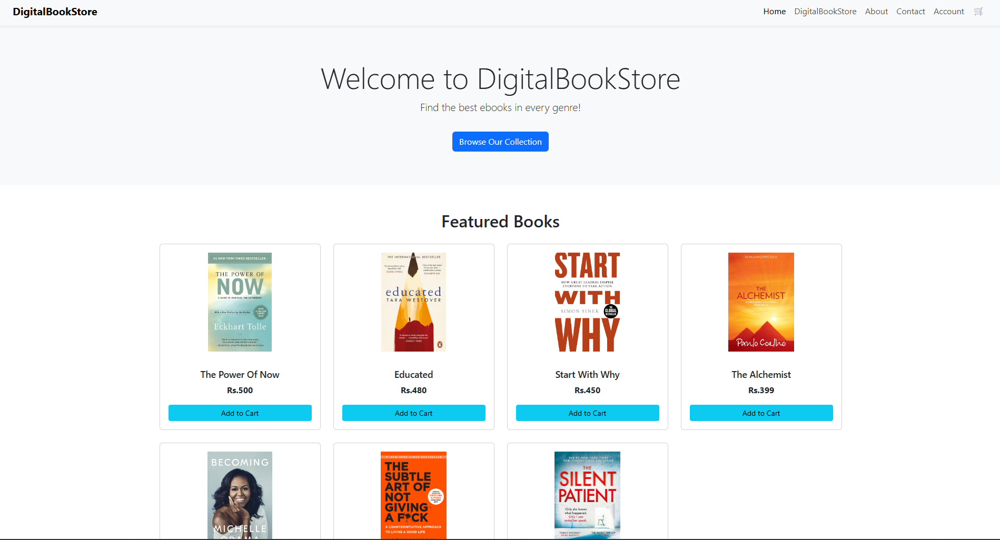
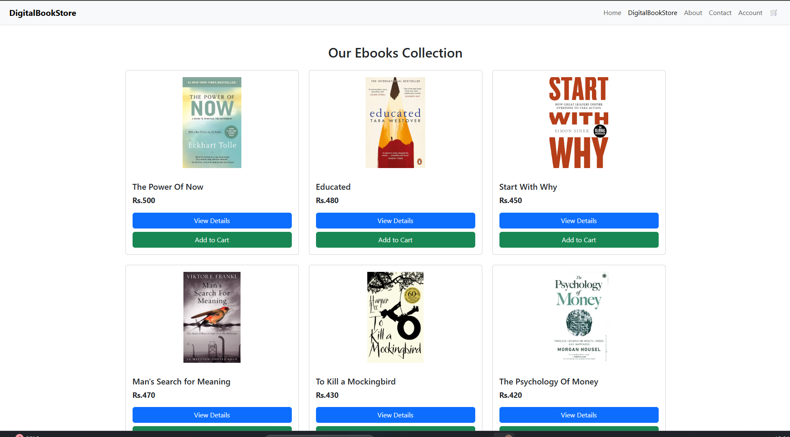
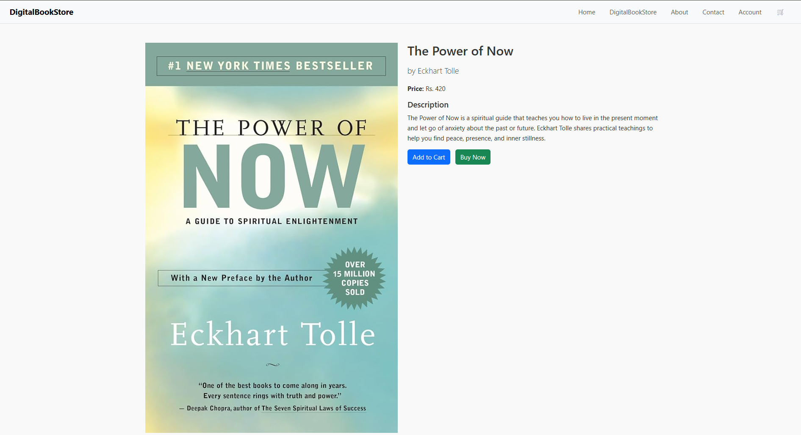
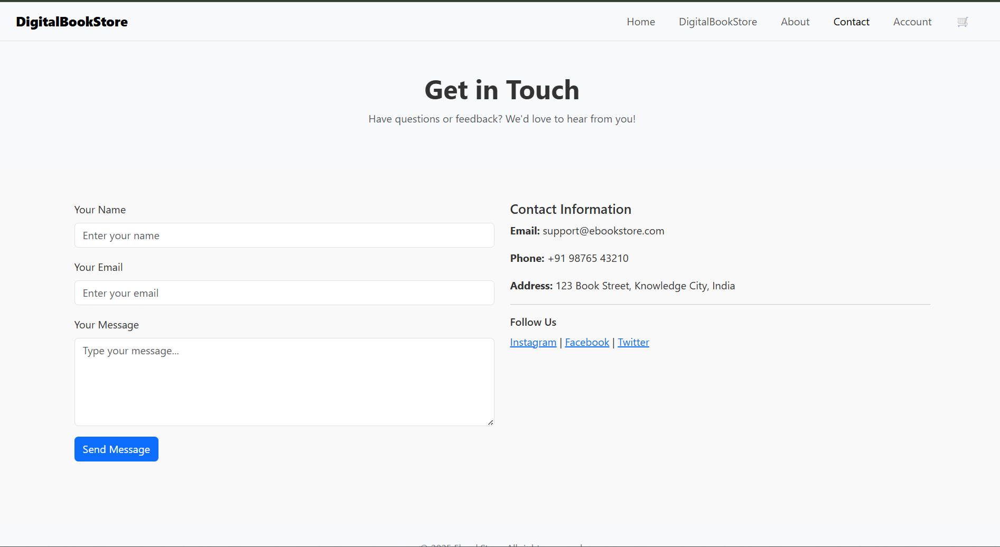
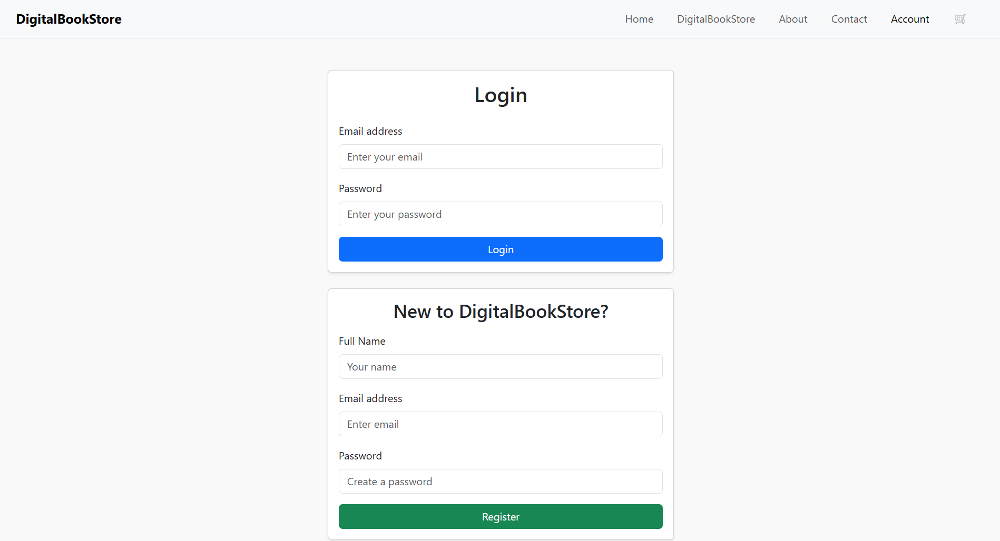

# 📚 DigitalBookStore

A responsive web application that lets users browse, view, and purchase digital books.  
Built with **HTML**, **CSS**, **JavaScript**, and **Bootstrap** for a modern, user-friendly experience.

---

## 🚀 Features

- 📖 Browse and view detailed information about ebooks  
- 🛒 Add books to a shopping cart and manage selections  
- 🔐 User login and registration (frontend simulation)  
- 📞 Contact form for inquiries  
- 📱 Fully responsive design for desktops and mobile devices  

---

## 🚀 Getting Started

1. Clone or download the repository.  
2. Open `index.html` in any modern web browser to start exploring.  
3. No backend required; all features run on the frontend.  

*(Optional)* You can deploy this on GitHub Pages or any static hosting service for live access.

---

## 📁 Project Structure

<pre>DigitalBookStore/
├── index.html        # Homepage with featured books and navigation  
├── about.html        # About Us page  
├── account.html      # User login and registration forms  
├── ebooks.html       # Ebooks listing page  
├── book-detail.html  # Detailed view of a single book  
├── book-detail.js    # JavaScript for book detail interactions  
├── cart.html         # Shopping cart page  
├── cart.js           # JavaScript managing cart functionality  
├── contact.html      # Contact form page  
├── script.js         # Common JavaScript used across pages  
├── style.css         # Custom CSS styles  
</pre>

---

## 📷 Screenshots

  
  
  
  
  
  
  

---

## 🛠️ Tech Stack

- HTML5  
- CSS3  
- JavaScript (ES6)  
- Bootstrap 5  

---

## 📬 Contact

Created by [Sindhura-Karumuri](https://github.com/Sindhura-Karumuri) — feel free to reach out for questions or contributions!

---

## 📄 License

This project is licensed under the MIT License. See the [LICENSE](LICENSE) file for details.
